<div align="center">



<br>

<a href="#quick-start"></a>
<a href="#how-it-works"></a>
<a href="#step-3--switch-on-the-daily-refresh"></a>
<a href="#step-5--write-your-info-card"></a>

<br><br>

<h3><code>~ $ cat WHAT_YOU_GET.md</code></h3>

A terminal-style GitHub profile: your face printed in shaded ASCII,<br>
a neofetch-style info card beside it, and your real contribution graph<br>
dropping in box by box. All of it is animated SVG committed to your own repo.

</div>

<br>

## Live example

This is my own profile ([github.com/deepakshebani](https://github.com/deepakshebani)), built with exactly the code in this repo. The graph below is pulled live from it, so it updates every day.

<div align="center">

<h3><code>deepak@github ~ $ ./contributions.sh</code></h3>


<br><br>

<h3><code>deepak@github ~ $ whoami</code></h3>
<table>
  <tr>
    <td valign="top"></td>
    <td valign="top"></td>
  </tr>
</table>

<sub>Each piece plays once and then holds. Refresh the page to watch it again.</sub>

</div>

<br>

## Contents

| | Step | What happens | Time |
|:-:|---|---|:-:|
| **1** | [Create the special repo](#step-1--create-the-special-repo) | A repo named after you becomes your profile | 1 min |
| **2** | [Copy the template](#step-2--copy-the-template) | Drop in the scripts, workflow and README | 2 min |
| **3** | [Switch on the daily refresh](#step-3--switch-on-the-daily-refresh) | Actions draws your real contribution graph | 2 min |
| **4** | [Turn your photo into ASCII](#step-4--turn-your-photo-into-ascii) | Cut-out, contrast, shaded glyphs, typing animation | 5 min |
| **5** | [Write your info card](#step-5--write-your-info-card) | Your story, in neofetch format | 2 min |
| **6** | [Tune the pace](#step-6--tune-the-pace) | Fast, cinematic or slow burn | 1 min |
| **7** | [Publish and check](#step-7--publish-and-check) | Upload, hard refresh, done | 1 min |
| | [Troubleshooting](#troubleshooting) · [How it works](#how-it-works) · [Credits](#credits) | | |

<br>

## How the pieces fit

<div align="center">

</div>

GitHub strips `<script>` and almost all CSS from READMEs, but it **does** render SVG files placed with ``, and it plays the animations inside them. So every bit of motion lives inside three self-contained SVG files, and the README only arranges them.

<br>

## Quick start

```bash
# 1. make the special repo (same name as your username) and clone it
gh repo create YOUR_USERNAME --public --clone && cd YOUR_USERNAME

# 2. copy everything from this repo's template/ folder into it
cp -r ../animated-github-profile/template/. .

# 3. make your portrait (on your own machine)
pip install -r scripts/requirements-portrait.txt
python scripts/prep_photo.py my-photo.jpg --oval
python scripts/make_ascii_svg.py --prompt "you@city:~$"

# 4. fill in your card, then build it
python scripts/make_info_card.py

# 5. push; the workflow draws your contribution graph
git add . && git commit -m "Animated profile" && git push
```

No terminal? Every step below also explains the browser-only route.

<br>

---

## Step 1 · Create the special repo

GitHub gives every account one special repository: a **public** repo whose name is **exactly your username**. Its `README.md` appears at the top of your profile page.

1. Go to **github.com/new**.
2. Type your username as the repository name. GitHub shows a note saying it's a special repository; that's how you know it's right.
3. Set it to **Public** and switch **Add README** on (this creates the `main` branch).
4. Click **Create repository**.

<br>

## Step 2 · Copy the template

Everything you need is in [`template/`](./template):

```text
template/
├── README.md                          # the terminal layout (edit the prompts)
├── .gitignore                         # keeps your original photo out of the repo
├── .github/workflows/
│   └── update-profile-art.yml         # daily heatmap refresh
├── data/                              # contributions.json lands here
└── scripts/
    ├── prep_photo.py                  # cut-out, contrast, eye sharpening
    ├── make_ascii_svg.py              # photo to shaded, self-typing ASCII
    ├── make_info_card.py              # neofetch-style card
    ├── fetch_contributions.py         # scrapes your public contribution page
    ├── render_heatmap_svg.py          # animated 53 x 7 grid
    ├── requirements.txt               # what the daily workflow needs
    └── requirements-portrait.txt      # what portrait-making needs (local only)
```

<details>
<summary><b>Browser-only route</b></summary>
<br>

1. Download this repo (**Code › Download ZIP**) and unzip it.
2. Open your profile repo and click **Add file › Upload files**.
3. Drag in the **contents** of `template/`, including the hidden `.github` folder.
   On a Mac press <kbd>Cmd</kbd> <kbd>Shift</kbd> <kbd>.</kbd> in Finder to show hidden folders; on Windows tick **View › Hidden items**.
4. Commit to `main`. Your upload replaces the starter README, which is what you want.

</details>

<br>

## Step 3 · Switch on the daily refresh

The workflow re-scrapes your contributions every morning and commits a fresh `contrib-heatmap.svg`.

1. In your profile repo open **Settings › Actions › General**.
2. Under **Workflow permissions** choose **Read and write permissions** and save.
3. Open the **Actions** tab, pick **Update profile art**, click **Run workflow**.

Within about a minute a bot commit adds `contrib-heatmap.svg` and `data/contributions.json`. It then runs daily at 06:17 UTC and on every push.

<details>
<summary><b>What the workflow does</b></summary>
<br>

```yaml
on:
  schedule:
    - cron: "17 6 * * *"     # daily
  workflow_dispatch: {}       # the "Run workflow" button
  push:
    branches: [main]

permissions:
  contents: write             # lets it commit the new SVG

steps:
  - run: python scripts/fetch_contributions.py   # reads github.com/users/<you>/contributions
  - run: python scripts/render_heatmap_svg.py    # draws the animated grid
  - uses: stefanzweifel/git-auto-commit-action@v5
```

No API token is needed: GitHub serves your contribution calendar as public HTML, the same fragment your profile page uses. `[skip ci]` in the bot's commit message stops it re-triggering itself.

</details>

<br>

## Step 4 · Turn your photo into ASCII

This runs once on your own machine, whenever you change your photo.

```bash
pip install -r scripts/requirements-portrait.txt
```

### 4a · Prep the photo

```bash
python scripts/prep_photo.py my-photo.jpg --oval
```

This removes the background with a human-segmentation model, keeps only the largest shape, boosts local contrast (CLAHE), sharpens edges and writes `source-prepped.png` with transparency, so the ASCII step knows exactly where you are.

| Flag | Use it when | Example |
|---|---|---|
| `--crop x0,y0,x1,y1` | The photo has lots of body or background. Crop to your head for a **face-only** look | `--crop 225,295,555,770` |
| `--oval` | You want a soft oval fade to black around the head. Also trims shoulders and stray background | `--oval` |
| `--hair-clean N` | Bits of background stick to your hair. Drops anything lighter or warmer than hair in the top N pixels | `--hair-clean 400` |
| `--eyes "x,y;x,y"` | Eyes look soft. Adds contrast around each eye centre (original pixel coordinates) | `--eyes "128,118;174,118"` |
| `--eye-boost 0.5` | How strong the eye boost is. Above 1 tends to look like sunglasses | `--eye-boost 0.5` |

> [!TIP]
> Face-only crops read far better than head-and-shoulders. At 80 characters wide, each eye in a full-body shot is only about 5 characters across; crop to the head and it doubles.

### 4b · Convert to a self-typing SVG

```bash
python scripts/make_ascii_svg.py --prompt "you@city:~$"
```

This writes `ascii-portrait.svg`: a terminal window with your face shaded from dim green to mint, a soft phosphor glow, faint CRT scanlines, a faint "ghost" preview, row-by-row typing with a block cursor, and a blinking prompt at the end.

| Flag | Default | What it changes |
|---|:-:|---|
| `--cols` | `80` | Width in characters. More detail, smaller glyphs |
| `--bg` | `#000000` | Panel background |
| `--aspect` | `1.3` | Panel height ÷ width. `1.3` matches the info card at 370px |
| `--title` | `~/portrait.ascii` | Text in the title bar |
| `--prompt` | `you@github:~$` | The blinking prompt under the portrait |
| `--mono` | off | The plain one-colour look from the original blog post |
| `--negative` | off | Dark pixels become dense glyphs (for light backgrounds) |

<details>
<summary><b>Why it maps brightness to density</b></summary>
<br>

On a dark background, bright pixels need the densest glyphs (`@`, `%`, `B`) and shadows the sparsest (`.`, `'`). The opposite mapping prints a photo negative: dark hair and sunglasses come out brightest. Each glyph is also coloured by its brightness on a 10-step ramp, because at roughly 4px per character the colour carries the likeness more than the glyph shape does.

</details>

<br>

## Step 5 · Write your info card

Open `scripts/make_info_card.py` and edit the block at the top:

```python
TITLE = "you@github"
ROWS = [
    ("Role",      "What you do, in one line"),
    ("Location",  "City, Country"),
    ("Now",       "What you're working on or looking for"),
    ("Prev",      "Previous role or company"),
    ("Contact",   "you@example.com"),
]
```

Then run `python scripts/make_info_card.py`. Long values wrap automatically. Keep the numbers on the contribution graph and use the card for the story numbers can't tell.

<br>

## Step 6 · Tune the pace

Slower animations look more deliberate. These are the three presets I compared; the repo defaults to **B**.

| Preset | Portrait | Info card (env vars) | Heatmap (env vars) | Feel |
|:-:|---|---|---|---|
| **A** Smooth | `--type-time 4.5 --row-dur 0.6 --no-ghost --delay 0` | `CARD_STEP=0.25 CARD_START=0.6 CARD_FADE=0.6` | `HEAT_STEP=0.04 HEAT_DROP=0.5` | Done in ~5s |
| **B** Cinematic | defaults | defaults | defaults | Ghost, then ~9s print |
| **C** Slow burn | `--type-time 10 --row-dur 1.0 --delay 1.5` | `CARD_STEP=0.5 CARD_START=2.0 CARD_FADE=1.0` | `HEAT_STEP=0.08 HEAT_DROP=0.7` | ~13s, dramatic |

```bash
# example: preset C
python scripts/make_ascii_svg.py --type-time 10 --row-dur 1.0 --delay 1.5
CARD_STEP=0.5 CARD_START=2.0 CARD_FADE=1.0 python scripts/make_info_card.py
```

For the heatmap, put the env vars on the render step in the workflow so the daily refresh keeps them:

```yaml
- run: python scripts/render_heatmap_svg.py
  env:
    HEAT_STEP: "0.08"
    HEAT_DROP: "0.7"
```

<br>

## Step 7 · Publish and check

1. Commit `ascii-portrait.svg`, `info-card.svg` and any script changes. Never commit your original photo; `.gitignore` already covers `source-*` and `my-photo.*`.
2. Open your profile and press <kbd>Ctrl</kbd> <kbd>Shift</kbd> <kbd>R</kbd>. GitHub caches images for a few minutes.

The layout in `README.md` is a centred two-column table. The heatmap is 860 wide, which equals the portrait (370) plus the card (490), so the edges line up.

<br>

---

## Troubleshooting

| Symptom | Cause | Fix |
|---|---|---|
| ASCII looks squashed or misaligned on GitHub | Browsers collapse runs of spaces, even with `xml:space` | Already handled: the script writes non-breaking spaces |
| Profile still shows the old image | GitHub's image cache | Hard refresh, or wait a few minutes |
| Background bits stuck to hair | Segmentation joined them to you | `--hair-clean N`, `--oval`, or a tighter `--crop` |
| Eyes look like dark blobs | Eye boost too strong for the size | Lower `--eye-boost`, crop tighter, or raise `--cols` |
| Animation frozen on the first frame | Your tab was in the background, so the browser paused it | Click into the tab and refresh |
| Workflow fails to push | Actions only has read permission | Step 3: **Read and write permissions** |
| `no contribution cells found` | GitHub changed its markup | Open an issue with the workflow log |
| `<h1>` or `<h2>` shows an underline | GitHub styles them with a rule | The template uses `<h3>` |
| Spacing ignored | Inline `style` is stripped | Use `<br>` for vertical space |

<br>

## How it works

- **Motion inside SVG.** Typing uses SMIL `<animate>` on per-row clip paths; the card and heatmap use CSS keyframes inside the SVG's own `<style>`. Both run inside ``, and everything is set to play once and hold (`fill="freeze"` or `forwards`).
- **No hosted widgets.** Third-party stats cards render on someone else's server, hit rate limits and sometimes break. These files live in your repo and load instantly.
- **Your data stays yours.** The only outside dependency is your public contribution page, read without a token.
- **Effects.** A feGaussianBlur glow, a 3px scanline pattern, a gradient "sweep" after printing, and a ghost layer that fades in at 14% opacity before typing begins.

<br>

## Credits

Inspired by Avi Vashishta's write-up, [How I Built an Animated GitHub Profile README](https://www.avivashishta.com/blog/build-animated-github-profile-readme). This repo writes out every script, and adds the background cut-out, face-only crop, eye sharpening, per-glyph shading, terminal frame and pace presets.

<div align="center">
<br>
<sub>Built by <a href="https://github.com/deepakshebani">Deepak Shebani</a> · Dublin · MIT licence</sub>
</div>
